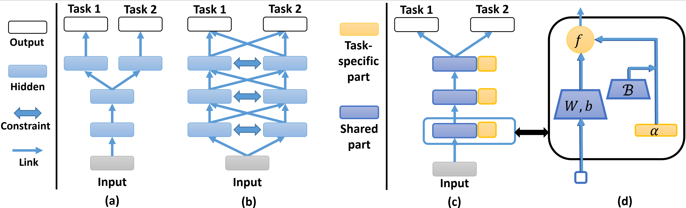

# KAAN
This repository contains the Pytorch implementation of my paper:
> Y. Liu, X. Yang, D. Xie, X. Wang, L. Shen, H. Huang, N. Balasubramanian,
"_Adaptive Activation Network and Functional Regularization for Efficient and Flexible Deep Multi-Task Learning._" 
in <ins>Proceedings of the 34th AAAI Conference on Artificial Intelligence (AAAI-20)</ins>, 2020. [[citation]](Documents/TAAN.bib)

In this paper, we are going to automatically learn the optimal splitting of network architecture for deep Multi-Task
Learning in a scalable way.

## Set Up
### Prerequisites
 - Pytorch == 1.1.0
 - Pyorch-Ignite == 0.2.0
 - h5py == 2.9.0
 
### Getting Started
Inside this repository, we conduct comprehensive experiments on two datasets.
- Youtube-8M (video-level features); [[link]](https://research.google.com/youtube8m/)

- Omniglot; [[link]](https://github.com/brendenlake/omniglot)

We also implement several recent deep Multi-Task Learning methods, including:

- Multilinear Relationship Network [(MRN)](https://papers.nips.cc/paper/6757-learning-multiple-tasks-with-multilinear-relationship-networks): soft-sharing method that models task relationship
by tensor Gaussian distribution. [[citation]](Documents/MRN.bib)
- Deep Multi-Task Representation Learning [(DMTRL)](https://openreview.net/forum?id=SkhU2fcll): soft-sharing method based on tensor decomposition. [[citation]](Documents/DMTRL.bib)
- Soft Layer Ordering [(Soft-Order)](): compute task-specific order of the shared sets of hidden layer. [[citation]](Documents/Soft_Order.bib)
- [Cross-Stitch](https://openreview.net/forum?id=SkhU2fcll): soft-sharing method that computes feature by linear combination of the task-specific hidden layers. [[citation]](Documents/cross_stitch.bib)
- Multi-gate Mixture-of-Experts [(MMoE)](https://dl.acm.org/doi/10.1145/3219819.3220007): Computes the last hidden feature by the gated combination of a set of neural networks (Experts). [[citation]](Documents/MMoE.bib)

The implementations can be found in the path `Youtube8M/models.py`.

## Experiments

### Layer Implementation
In the path `Layers`, we already implement the layers of MRN, DMTRL and TAL in our model. You can directly use them as the 
general Pytorch layers `nn.Linear` and `nn.Conv2d`. The only difference is that these layers have some extra parameters to set-up the regularization based on their proposed methods,
and they have an additional member function `self.regularization(c)` that computes the corresponding
regularization term with respect to the Lagrangian coefficient `c`. The details are given in [`Layers/README.md`](Layers/README.md).

### Run on Datasets
For the detailed instructions on reproducing our experiments, please refer
[`Youtube8M/README.md`](Youtube8M/README.md) and [`Omniglot/README.md`](Omniglot/README.md).